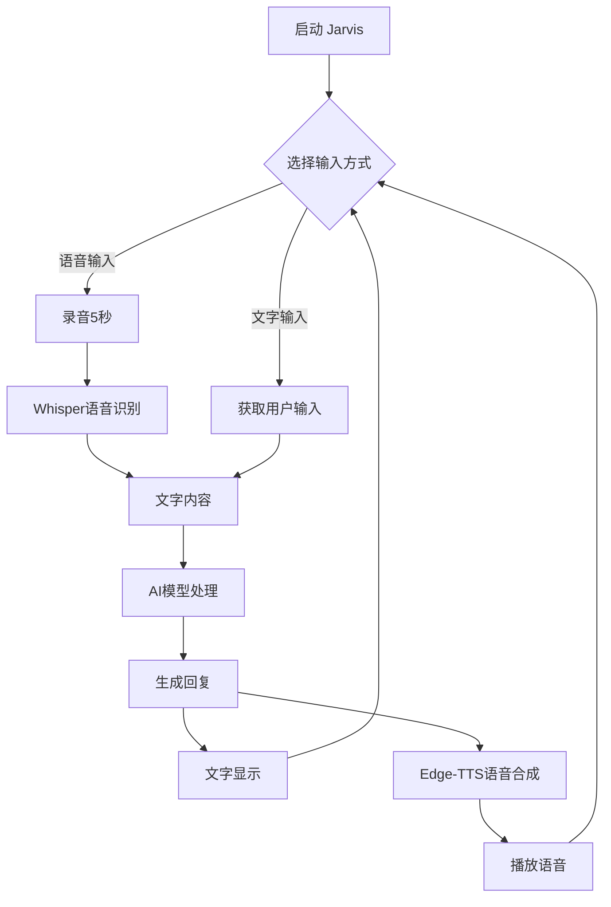
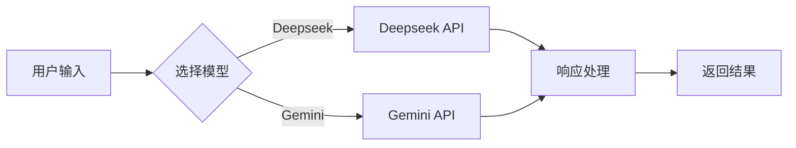
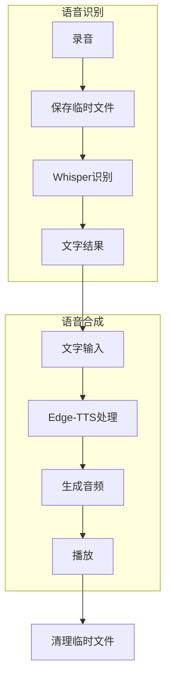
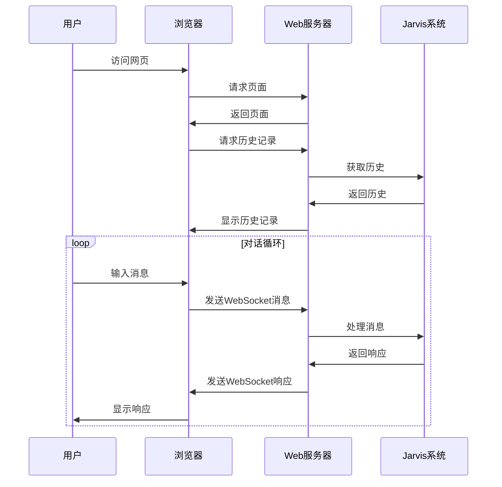

# Jarvis AI 助手

基于钢铁侠电影中的 J.A.R.V.I.S. (Just A Rather Very Intelligent System) 打造的智能助手系统。

## 系统流程

### 基本工作流程



### AI模型处理流程



### 语音处理流程



## 功能特点

- 多AI模型支持（Deepseek和Gemini）
- 语音交互功能
  - 语音识别（Whisper）
  - 语音合成（Edge-TTS）
  - 多种声音选项
- 模块化设计
- 完整的日志系统
- 安全的配置管理

## 安装步骤

1. 克隆项目：
~~~bash
git clone <repository_url>
cd jarvis
~~~

2. 创建并激活虚拟环境：
~~~bash
# Linux/Mac
python -m venv venv
source venv/bin/activate

# Windows
python -m venv venv
venv\Scripts\activate
~~~

3. 安装依赖：
~~~bash
pip install -r requirements.txt
~~~

4. 安装系统依赖：
~~~bash
# Mac
brew install ffmpeg portaudio

# Linux
sudo apt-get install ffmpeg portaudio19-dev python3-pyaudio

# Windows
# 通常无需额外安装
~~~

5. 配置环境变量：
   - 复制 `.env.example` 为 `.env`
   - 在 `.env` 中填入你的API密钥：
~~~ini
DEEPSEEK_API_KEY=your_deepseek_api_key_here
DEEPSEEK_API_BASE=your_deepseek_api_base_url_here
GEMINI_API_KEY=your_gemini_api_key_here
~~~

## 使用方法

1. 运行Jarvis：
~~~bash
python jarvis.py
~~~

2. 选择交互方式：
   - 1: 文字输入
   - 2: 语音输入（5秒录音）
   - q: 退出程序

3. 语音设置：
~~~python
# 切换AI模型
jarvis = Jarvis(ai_model="gemini")  # 或 "deepseek"

# 切换语音（可用的中文语音）
jarvis.speech_synthesizer = EdgeTTSSynthesizer(voice="zh-CN-XiaoxiaoNeural")  # 默认女声
jarvis.speech_synthesizer = EdgeTTSSynthesizer(voice="zh-CN-YunxiNeural")     # 男声
jarvis.speech_synthesizer = EdgeTTSSynthesizer(voice="zh-CN-YunyangNeural")   # 男声，新闻播报风格
jarvis.speech_synthesizer = EdgeTTSSynthesizer(voice="zh-CN-XiaochenNeural")  # 女声，温柔风格
~~~

## 项目结构

~~~
jarvis/
├── logs/           # 日志文件目录
├── temp/           # 临时音频文件目录
├── speech/         # 语音处理模块
│   ├── __init__.py
│   ├── recognizer.py   # 语音识别
│   └── synthesizer.py  # 语音合成
├── utils/
│   ├── __init__.py
│   └── logger.py   # 日志配置
├── ai_models.py    # AI模型实现
├── config.py       # 配置管理
├── jarvis.py       # 主程序
├── requirements.txt
└── README.md
~~~

## 语音功能

### 语音识别
- 使用OpenAI的Whisper模型
- 支持实时录音
- 自动管理临时文件
- 支持多种语言

### 语音合成
- 使用Microsoft Edge TTS
- 多种声音选项
- 高质量语音输出
- 无需API密钥

## 日志系统

- 日志存储在 `logs` 目录
- 按日期命名：`jarvis_YYYYMMDD.log`
- 自动分割：每个文件最大10MB
- 保留最近5个备份文件
- 同时输出到控制台和文件

## 开发说明

1. 添加新的AI模型：
   - 在 `ai_models.py` 中继承 `BaseAIModel`
   - 实现 `generate_response` 方法
   - 在 `config.py` 中添加相应配置

2. 日志级别：
   - DEBUG: 详细调试信息
   - INFO: 一般信息
   - WARNING: 警告信息
   - ERROR: 错误信息
   - CRITICAL: 严重错误

## 注意事项

- 请勿将 `.env` 文件提交到版本控制系统
- 建议定期检查和清理日志文件
- API密钥请妥善保管，不要泄露
- 临时音频文件会自动清理
- 确保系统音量适中

## 依赖列表

- openai: Deepseek API 客户端
- google-generativeai: Gemini API 客户端
- openai-whisper: 语音识别
- edge-tts: 语音合成
- sounddevice: 录音支持
- soundfile: 音频处理
- python-dotenv: 环境变量管理
- python-json-logger: JSON格式日志支持

## 许可证

[添加你的许可证信息]

## 贡献指南

1. Fork 项目
2. 创建特性分支
3. 提交更改
4. 推送到分支
5. 创建 Pull Request

## 联系方式

[添加你的联系方式]

## Web界面

Jarvis现在提供了一个现代化的Web界面，让您可以通过浏览器与AI助手进行交互。

### 启动Web服务

```bash
# 进入项目目录
cd Jarvis

# 启动Web服务
python web/app.py
```

服务启动后，访问 http://localhost:5000 即可使用Web界面。

### Web界面功能

- 实时对话：通过WebSocket实现即时响应
- Markdown支持：支持富文本显示
- 历史记录：自动加载最近的对话记录
- 响应式设计：支持移动端访问

### Web界面流程图

