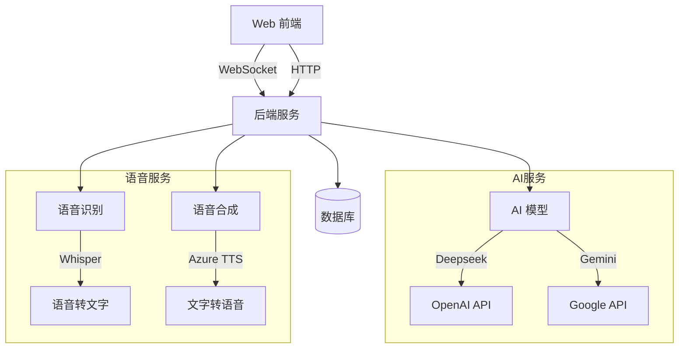

# Jarvis - 智能助手系统

基于钢铁侠电影中的 J.A.R.V.I.S. (Just A Rather Very Intelligent System) 打造的个人智能助手系统。

## 功能特性

- 🤖 多模型支持
  - Deepseek
  - Gemini
- 🎙️ 语音交互
  - Whisper 语音识别（支持多种模型）
  - Azure TTS 语音合成（支持多种声音）
- 📊 数据可视化
  - Mermaid 图表
  - ECharts 图表
- 💬 实时对话
  - WebSocket 实时通信
  - 流式响应输出
  - 自动重连机制
- 📝 历史记录
  - 本地数据库存储
  - 会话管理
  - 统计分析
- 🎨 界面设计
  - 响应式布局
  - 深色/浅色主题
  - 平滑动画效果

## 系统架构



## 技术栈

### 前端
- React 18
- TypeScript
- Ant Design 5
- ECharts
- Mermaid
- WebSocket

### 后端
- Python
- FastAPI
- SQLite
- Whisper
- Azure TTS

## 快速开始

1. 克隆仓库：
```bash
git clone https://github.com/yourusername/jarvis.git
cd jarvis
```

2. 安装依赖：

前端：
```bash
cd web-client
npm install
```

后端：
```bash
pip install -r requirements.txt
```

3. 配置环境变量：
```bash
cp .env.example .env
# 编辑 .env 文件，填入必要的 API keys
```

4. 启动服务：

前端：
```bash
cd web-client
npm run dev
```

后端：
```bash
python server/api.py
```

## 目录结构

```
jarvis/
├── server/             # 后端服务
│   ├── api.py         # FastAPI 服务
│   └── jarvis.py      # 核心逻辑
├── web-client/        # 前端应用
│   ├── src/
│   │   ├── components/
│   │   ├── services/
│   │   └── App.tsx
│   └── package.json
├── speech/            # 语音服务
│   ├── recognizer.py
│   └── synthesizer.py
├── utils/             # 工具函数
│   ├── logger.py
│   └── database.py
└── README.md
```

## 配置说明

### AI 模型配置
- Deepseek API
  - `DEEPSEEK_API_KEY`
  - `DEEPSEEK_API_BASE`
- Gemini API
  - `GEMINI_API_KEY`

### 语音服务配置
- Whisper 模型选项：
  - Tiny (最快)
  - Base (快速)
  - Small (平衡)
  - Medium (较准)
  - Large (最准)
- Azure TTS 声音选项：
  - 晓晓 (女声)
  - 云希 (男声)
  - 云扬 (男声新闻)
  等多个选项

## 开发指南

### 添加新的 AI 模型
1. 在 `ai_models.py` 中继承 `BaseAIModel` 类
2. 实现必要的接口方法
3. 在配置中添加相应的 API 密钥

### 自定义图表
- 支持 Mermaid 语法
- 支持 ECharts 配置
- 自动适应深色/浅色主题

## 贡献指南

1. Fork 本仓库
2. 创建特性分支
3. 提交更改
4. 发起 Pull Request

## 许可证

MIT License 