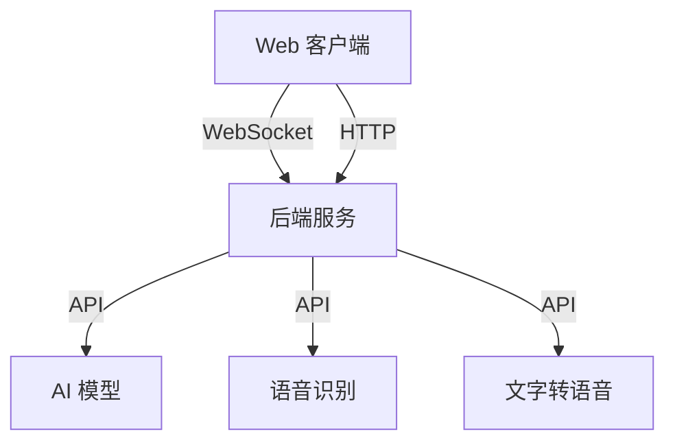

# Jarvis Web 客户端

这是 Jarvis 智能助手的 Web 客户端，使用 React + Ant Design + TypeScript 构建。

## 功能特性

- 🤖 支持多种 AI 模型（Deepseek、Gemini）
- 🎙️ 语音识别（Whisper）
- 🗣️ 文字转语音（Azure TTS）
- 💬 实时对话
- ⚡ 快速响应
- 🎨 美观的界面

## 技术栈

- React 18
- TypeScript
- Ant Design 5
- Vite
- Socket.IO
- React Markdown

## 系统架构



## 开发环境设置

1. 安装依赖：

```bash
npm install
```

2. 启动开发服务器：

```bash
npm run dev
```

3. 构建生产版本：

```bash
npm run build
```

## 项目结构

```
src/
├── components/     # React 组件
├── services/      # 服务（WebSocket等）
├── App.tsx        # 主应用组件
├── main.tsx       # 入口文件
└── vite-env.d.ts  # TypeScript 声明文件
```

## 配置说明

- 开发服务器运行在 3000 端口
- WebSocket 连接到 5000 端口
- 支持的 AI 模型：
  - Deepseek
  - Gemini
- 语音识别模型选项：
  - Tiny（最快）
  - Base（快速）
  - Small（平衡）
  - Medium（较准）
  - Large（最准）
- 文字转语音声音选项：
  - 晓晓（女声）
  - 云希（男声）
  - 云扬（男声新闻）
  等多个选项

## 注意事项

1. 确保后端服务已启动并运行在 5000 端口
2. WebSocket 连接需要稳定的网络环境
3. 语音功能需要浏览器支持麦克风访问
